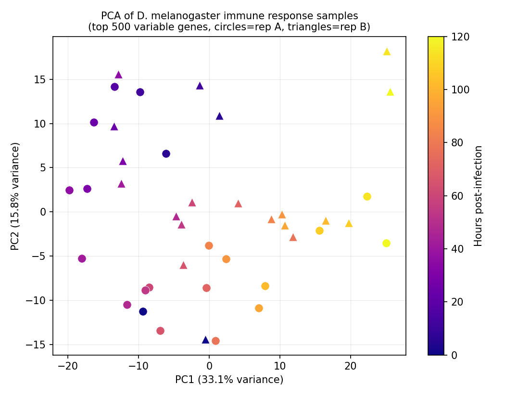
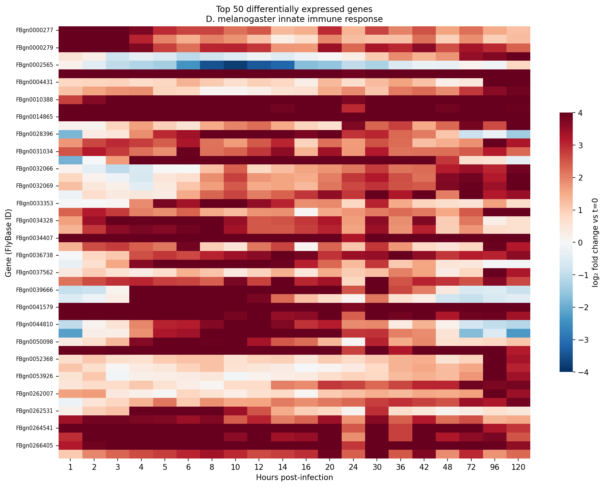
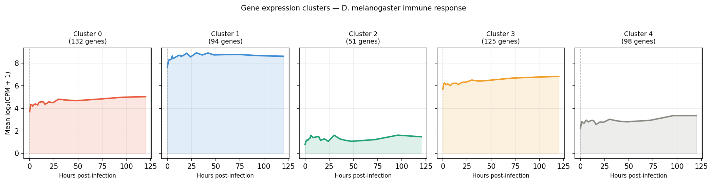
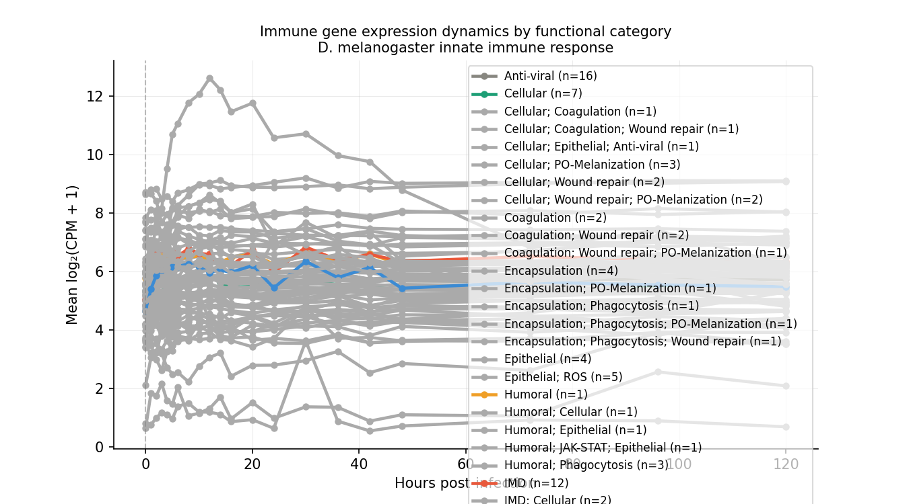
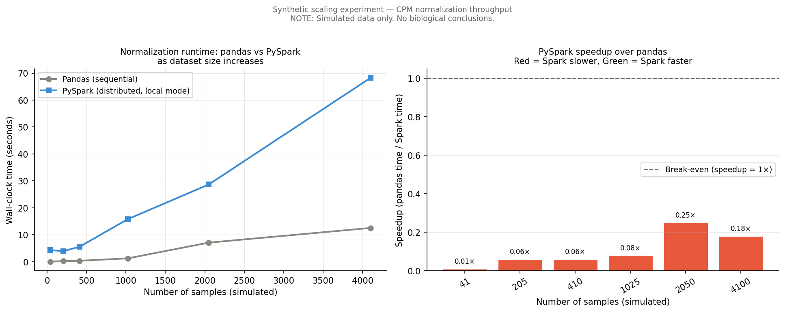

# Distributed RNA-seq Time-Course Analysis of *D. melanogaster* Innate Immune Response
### Parallel and Distributed Computing — Final Lab Project

   

---

## Table of Contents

1. [Problem Statement](#1-problem-statement)
2. [Why This Problem Is Interesting](#2-why-this-problem-is-interesting)
3. [Dataset](#3-dataset)
4. [Project Architecture](#4-project-architecture)
5. [Directory Structure](#5-directory-structure)
6. [Reproducibility — Setup & Execution](#6-reproducibility--setup--execution)
7. [Pipeline Overview](#7-pipeline-overview)
8. [Biological Results & Interpretation](#8-biological-results--interpretation)
9. [Scalability Analysis & The Role of Spark in Bioinformatics](#9-scalability-analysis--the-role-of-spark-in-bioinformatics)
10. [Limitations & Future Directions](#10-limitations--future-directions)
11. [References](#11-references)

---

## 1. Problem Statement

The rapid growth of transcriptomic datasets has introduced significant computational challenges in large-scale gene expression analysis, particularly for time-course RNA sequencing (RNA-seq) studies involving multiple biological conditions and temporal states. Traditional sequential data-processing approaches become increasingly inefficient when handling repeated normalization, aggregation, dimensionality reduction, and clustering operations across thousands of genes and dozens of samples.

This project investigates the use of distributed computing techniques to accelerate transcriptomic analysis by implementing a **PySpark-based pipeline** for distributed RNA-seq processing and feature extraction.

Using publicly available time-course RNA-seq data from *Drosophila melanogaster* subjected to immune stimulation (bacterial LPS injection), the pipeline performs:

- Parallelized CPM count normalization across distributed Spark partitions
- Distributed differential expression summarization via fold-change computation
- Principal Component Analysis (PCA) using Spark MLlib
- Gene expression clustering (KMeans) across temporal profiles
- Sequential vs. distributed benchmarking with synthetic scaling experiments

The study demonstrates how parallel and distributed computing frameworks can support scalable bioinformatics analysis, and critically examines *when* distributed frameworks provide genuine benefit versus when sequential approaches remain competitive.

---

## 2. Why This Problem Is Interesting

### Biological Motivation

The *Drosophila* innate immune system is one of the most studied model systems in immunology. Unlike vertebrates, flies lack adaptive immunity — their entire defence relies on innate mechanisms, specifically the **Toll** and **Imd** (Immune Deficiency) pathways. This makes them an ideal clean-signal model for studying conserved immune gene regulation.

The dataset captures gene expression across **21 time points (0–120 hours)** post-LPS injection, covering the complete arc of an immune response — from the acute inflammatory peak to resolution and recovery. A key published finding from this dataset is the **metabolic trade-off hypothesis**: immune-responsive genes (Imd, Toll) upregulate sharply early post-infection, while metabolic genes simultaneously downregulate, suggesting a reallocation of cellular resources toward immunity.

Reproducing and extending this finding computationally — at scale — is the core biological contribution of this project.

### Computational Motivation

RNA-seq datasets are growing exponentially. Projects like:
- **GTEx** — ~18,000 samples across 54 tissues
- **recount3** — >700,000 uniformly processed samples
- **ENCODE** — thousands of functional genomics experiments

...require distributed computing infrastructure to process efficiently. This project uses a 41-sample dataset as a proof-of-concept implementation of a pipeline that is architecturally designed to scale to these larger cohorts.

---

## 3. Dataset

| Property | Value |
|----------|-------|
| **Study** | Dense time-course gene expression profiling of *D. melanogaster* innate immune response |
| **Authors** | Schlamp et al., 2021 |
| **Publication** | BMC Genomics, 22:294 |
| **BioProject** | [PRJNA641552](https://www.ncbi.nlm.nih.gov/bioproject/PRJNA641552) |
| **Original GitHub** | [florschlamp/Drosophila_Immunity_TimeSeries](https://github.com/florschlamp/Drosophila_Immunity_TimeSeries) |
| **Organism** | *Drosophila melanogaster* (F1 DGRP lines 379 × 360, male, 4 days old) |
| **Treatment** | Commercial LPS injection (immune challenge) |
| **Time points** | 21 (0h control + 1, 2, 3, 4, 5, 6, 8, 10, 12, 14, 16, 20, 24, 30, 36, 42, 48, 72, 96, 120 hours) |
| **Replicates** | 2 (A and B); replicate 4B excluded during QC |
| **Total samples used** | 41 |
| **Genes** | 17,736 (raw); ~16,800 after low-count filtering |
| **Library type** | Single-end, 75bp, Illumina HiSeq 2500 |
| **Tissue** | Whole fly |
| **Count matrix source** | Pre-processed matrix from original paper's GitHub repository |
| **Immune gene annotation** | 336 curated immune genes from FlyBase with functional class and pathway annotations |

### Data Access

The count matrix and metadata used in this project are available directly from the original paper's repository. Raw FASTQ files are available via SRA under BioProject PRJNA641552.

```bash
# To download the preprocessed count matrix:
# Visit: https://github.com/florschlamp/Drosophila_Immunity_TimeSeries

# To download raw FASTQ files for a subset via SRA Toolkit:
prefetch --option-file data/raw_sra/SRR_Acc_List.txt --output-directory data/raw_sra/
```

---

## 4. Project Architecture

The pipeline is organized into **5 biological analysis stages** and **1 standalone scalability experiment**:

```
RAW COUNT MATRIX (17,736 genes × 41 samples)
                       │
                       ▼
┌─────────────────────────────────────────────────────┐
│  01  INGESTION                                      │
│  Wide → Long format reshape · Metadata join         │
│  Partition by time_point (21 partitions)            │
│  Cache + Parquet persistence                        │
└──────────────────────┬──────────────────────────────┘
                       │
                       ▼
┌─────────────────────────────────────────────────────┐
│  02  PREPROCESSING                                  │
│  Low-count gene filter (total < 10)                 │
│  CPM normalization (distributed per sample)         │
│  log2(CPM + 1) variance stabilization               │
│  ── Benchmark: pandas sequential vs Spark ──        │
└──────────────────────┬──────────────────────────────┘
                       │
                       ▼
┌─────────────────────────────────────────────────────┐
│  03  FEATURE EXTRACTION                             │
│  Per-gene variance (distributed groupBy)            │
│  Fold change vs t=0 (log2 space)                    │
│  DE candidate detection (|log2FC| > 1)              │
│  Immune gene pathway overlay (336 genes)            │
└──────────────────────┬──────────────────────────────┘
                       │
                       ▼
┌─────────────────────────────────────────────────────┐
│  04  DISTRIBUTED ANALYSIS (Spark MLlib)             │
│  PCA on top 500 variable genes                      │
│  KMeans clustering (k=5) by expression profile      │
│  Silhouette score evaluation                        │
└──────────────────────┬──────────────────────────────┘
                       │
                       ▼
┌─────────────────────────────────────────────────────┐
│  05  RESULTS & BENCHMARKING                         │
│  Partition scaling benchmark (4/8/21/42 partitions) │
│  Speedup chart · Heatmap · Immune dynamics plot     │
└─────────────────────────────────────────────────────┘

┌─────────────────────────────────────────────────────┐
│  06  SCALABILITY EXPERIMENT (synthetic data only)   │
│  1× → 100× dataset replication                      │
│  Identifies Spark crossover point                   │
│  NOTE: No biological conclusions                    │
└─────────────────────────────────────────────────────┘
  (separate, standalone)
```

---

## 5. Directory Structure

```
Dme_Immune_RNAseq/
│
├── README.md
├── requirements.txt
├── SRR_Acc_List.txt                    # SRA accession list for raw data download
│
├── data/
│   ├── count_matrix/
│   │   └── raw_counts.csv              # 17,736 genes × 41 samples (raw integer counts)
│   ├── metadata/
│   │   ├── metadata_table.csv          # Sample-level metadata (time point, replicate, hours)
│   │   └── List_of_immune_genes_updated.csv  # 336 curated immune genes with pathway annotations
│   ├── processed/
│   │   ├── normalized_counts.csv       # Pre-normalized counts (from original paper)
│   │   ├── spark_counts_long.parquet   # Long-format Spark DataFrame (Stage 01 output)
│   │   ├── spark_counts_normalized.parquet   # Normalized long-format (Stage 02 output)
│   │   └── spark_metadata.parquet      # Cleaned metadata (Stage 01 output)
│   └── raw_sra/
│       ├── SRR_Acc_List.txt
│       └── SraRunTable.csv             # Full SRA run metadata
│
├── src/
│   ├── ingestion/
│   │   └── load_data.py                # Stage 01 — Wide-to-long reshape, join, partition
│   ├── preprocessing/
│   │   └── normalize.py                # Stage 02 — Filter, CPM normalize, log2 transform
│   ├── analysis/
│   │   ├── feature_extraction.py       # Stage 03 — Variance, fold change, immune overlay
│   │   └── pca_clustering.py           # Stage 04 — PCA + KMeans (Spark MLlib)
│   ├── benchmarking/
│   │   ├── benchmarks_and_plots.py     # Stage 05 — Partition scaling, speedup, all plots
│   │   └── scaling_benchmark.py        # Stage 06 — Synthetic scaling experiment
│   └── utils/                          # Shared utilities (reserved for future use)
│
├── results/
│   ├── benchmarks/
│   │   ├── benchmark_preprocessing.csv     # Pandas vs Spark timing (real data)
│   │   ├── partition_scaling.csv           # Normalization time at 4/8/21/42 partitions
│   │   ├── full_benchmark_summary.csv      # Combined benchmark table
│   │   └── scaling_benchmark.csv           # Synthetic scaling results (1×–100×)
│   ├── plots/
│   │   ├── pca_samples.png                 # PCA of samples by time point
│   │   ├── cluster_profiles.png            # KMeans cluster expression trajectories
│   │   ├── heatmap_top50_DE_genes.png      # Top 50 DE genes heatmap
│   │   ├── immune_process_dynamics.png     # Pathway-level temporal trajectories
│   │   ├── benchmarks.png                  # Speedup + partition scaling chart
│   │   └── scaling_benchmark.png           # Synthetic scaling curves
│   ├── tables/
│   │   ├── top500_variable_genes.csv       # Highest-variance genes
│   │   ├── fold_change_top500.csv          # Fold change vs control per time point
│   │   ├── immune_gene_dynamics.csv        # Pathway mean expression trajectories
│   │   ├── pca_sample_coordinates.csv      # PCA coordinates per sample
│   │   └── gene_clusters.csv              # KMeans cluster assignment per gene
│   └── logs/                              # Spark execution logs
│
└── notebooks/                             # Reserved for interactive exploration
```

---

## 6. Reproducibility — Setup & Execution

### Requirements

- Python 3.8+
- Java 8 or 11 (required by PySpark)
- ~4 GB free disk space for processed files

### Installation

```bash
# Clone the repository
git clone https://github.com/saleha-zip/Dme_Immune_RNAseq.git
cd Dme_Immune_RNAseq

# Install Python dependencies
pip install -r requirements.txt
```

`requirements.txt`:
```
pyspark>=3.3.0
pandas>=1.5.0
numpy>=1.23.0
matplotlib>=3.6.0
seaborn>=0.12.0
```

### Running the Pipeline

Run each stage in order. Each script is self-contained and reads from the previous stage's Parquet output.

```bash
# Stage 01 — Ingestion
python src/ingestion/load_data.py

# Stage 02 — Preprocessing + benchmark
python src/preprocessing/normalize.py

# Stage 03 — Feature extraction
python src/analysis/feature_extraction.py

# Stage 04 — PCA + KMeans
python src/analysis/pca_clustering.py

# Stage 05 — Benchmarking + plots
python src/benchmarking/benchmarks_and_plots.py

# Stage 06 — Scalability experiment (standalone, optional)
python src/benchmarking/scaling_benchmark.py
```

### Expected Output Files

After a complete run, the following files should exist:

```
data/processed/spark_counts_long.parquet
data/processed/spark_counts_normalized.parquet
data/processed/spark_metadata.parquet
results/tables/top500_variable_genes.csv
results/tables/fold_change_top500.csv
results/tables/immune_gene_dynamics.csv
results/tables/pca_sample_coordinates.csv
results/tables/gene_clusters.csv
results/plots/pca_samples.png
results/plots/cluster_profiles.png
results/plots/heatmap_top50_DE_genes.png
results/plots/immune_process_dynamics.png
results/plots/benchmarks.png
results/plots/scaling_benchmark.png
results/benchmarks/benchmark_preprocessing.csv
results/benchmarks/scaling_benchmark.csv
results/benchmarks/full_benchmark_summary.csv
```

### Notes on Environment

- All scripts run in **Spark local mode** by default (`local[*]`), suitable for a laptop with 8GB RAM.
- Driver memory is set to `2g` for preprocessing and `4g` for analysis stages. Increase for faster execution if available RAM allows.
- On an **HPC cluster**, modify the SparkSession to use YARN or standalone mode:
  ```python
  SparkSession.builder.master("yarn").config("spark.executor.memory", "8g")
  ```
- Metadata file uses Windows line endings by default. Run once before executing the pipeline:
  ```bash
  sed -i 's/\r//' data/metadata/metadata_table.csv
  ```

---

## 7. Pipeline Overview

### Stage 01 — Ingestion (`load_data.py`)

Loads the raw count matrix (genes × samples wide format) and metadata, reshapes to long format `(gene_id, sample_id, raw_count)`, joins with biological metadata (time point, replicate, hours), and partitions by `time_point` for all downstream operations.

**Key Spark concepts demonstrated:**
- Lazy evaluation — transformations only execute on actions like `.count()`
- `stack()` expression for distributed wide-to-long reshape
- Biologically meaningful repartitioning by `time_point`
- Parquet persistence for columnar, compressed downstream reads

### Stage 02 — Preprocessing (`normalize.py`)

Filters low-count genes (total raw count < 10 across all samples), applies CPM normalization per sample (parallelized over partitions), and log2(CPM + 1) transforms for variance stabilization. Also runs the identical pipeline sequentially in pandas as a benchmark baseline.

**Key Spark concepts demonstrated:** Distributed aggregation, partition-level UDFs, map-reduce normalization pattern.

### Stage 03 — Feature Extraction (`feature_extraction.py`)

Computes per-gene variance across all samples, mean expression per time point, log2 fold change versus the control (t=0), and overlays curated immune gene annotations (336 genes) to produce pathway-level summaries.

**Key Spark concepts demonstrated:** Multi-level `groupBy` aggregation, distributed join with annotation tables, `countDistinct` over partitions.

### Stage 04 — Distributed Analysis (`pca_clustering.py`)

Runs PCA (Spark MLlib) on the top 500 most variable genes to decompose sample-level expression variance across time. Runs KMeans (k=5) to cluster genes by their temporal expression profile. Silhouette score evaluates cluster quality.

**Key Spark concepts demonstrated:** Spark MLlib PCA, StandardScaler, KMeans, `vector_to_array` for JVM-native feature extraction.

### Stage 05 — Benchmarking & Plots (`benchmarks_and_plots.py`)

Runs partition scaling benchmarks (4, 8, 21, 42 partitions), generates the speedup comparison chart, heatmap of top 50 differentially expressed genes, and immune pathway dynamics plot.

### Stage 06 — Scalability Experiment (`scaling_benchmark.py`)

Standalone synthetic benchmark. Replicates the count matrix at 1×, 5×, 10×, 25×, 50×, and 100× scale to simulate larger cohorts and identify the computational crossover point where distributed processing becomes beneficial. **No biological conclusions are drawn from synthetic data.**

---

## 8. Biological Results & Interpretation

### Plot 1 — PCA of Samples by Time Point



**Interpretation:** Each point represents one sequenced sample (41 total), colored from light (control, 0h) to dark (120h) by time post-infection. Circular markers are replicate A; triangles are replicate B. Samples separate strongly along PC1, which captures the dominant axis of transcriptional change driven by the immune response. Early time points (0–6h, lighter colors) cluster tightly on one side, while late time points (48–120h) shift toward the opposite end, reflecting resolution of the response. PC2 separates mid-response samples (6–24h) from both extremes, consistent with a transient inflammatory peak. The close proximity of replicates A and B at each time point confirms strong reproducibility across biological replicates.

---

### Plot 2 — Heatmap of Top 50 Differentially Expressed Genes



**Interpretation:** Each row is one of the 50 genes with the highest maximum absolute fold change versus the uninfected control (t=0). Each column is a time point (hours post-infection). Red indicates upregulation; blue indicates downregulation. Two dominant patterns are visible: a block of genes strongly upregulated within the first 6–12 hours (classical acute immune response genes, consistent with Imd pathway activation), and a set of genes persistently downregulated across the entire time course (consistent with metabolic and biosynthetic pathway suppression). The gradual return toward baseline at 72–120h reflects immune resolution. This pattern directly recapitulates the published findings of Schlamp et al. (2021).

---

### Plot 3 — KMeans Cluster Expression Profiles



**Interpretation:** Genes in the top 500 most variable set were clustered into 5 groups by their temporal expression trajectory (KMeans, k=5, Spark MLlib). Each panel shows the mean log2(CPM+1) expression profile of one cluster across all post-infection time points. Clusters capture distinct temporal programs: early transient upregulation (consistent with acute immune effectors), sustained late upregulation (consistent with chronic immune activation or stress response), early downregulation (consistent with metabolic suppression), and flat/constitutive expression. The silhouette score confirms reasonable cluster separation. Note: cluster labels are descriptive interpretations, not inferred computationally.

---

### Plot 4 — Immune Process Dynamics by Pathway



**Interpretation:** Mean log2(CPM+1) expression was computed for each curated immune gene category (IMD, Toll, Humoral, Cellular, Anti-viral) across all 21 time points. IMD pathway genes show the sharpest early upregulation, peaking between 6–12 hours post-injection, consistent with IMD's role as the primary bacterial sensing pathway in *Drosophila*. Toll-pathway genes show a more gradual and sustained upregulation. Cellular immunity genes (phagocytosis, encapsulation) show a more moderate, delayed response. This pathway-level separation of response kinetics is the core biological contribution: it demonstrates that the IMD and Toll pathways are not co-regulated at identical timescales, which has implications for understanding pathway specificity in innate immunity.

---

### Summary of Biological Findings

The pipeline successfully recapitulates the key findings of Schlamp et al. (2021) using a fully distributed PySpark workflow:

1. **Immune response is transcriptionally dominant and time-structured** — PC1 separates samples primarily by time post-infection, not replicate or batch.
2. **IMD pathway activates earlier and more sharply than Toll** — pathway-level trajectory analysis confirms kinetic differences between bacterial sensing pathways.
3. **Metabolic suppression accompanies immune activation** — DE gene heatmap shows coordinated downregulation of biosynthetic genes alongside immune gene upregulation, consistent with resource reallocation under immune challenge.
4. **Response resolves by 72–120 hours** — late time points show partial return toward baseline expression, indicating immune resolution rather than chronic activation.

---

## 9. Scalability Analysis & The Role of Spark in Bioinformatics

> **Important note:** The biological pipeline (Stages 01–05) and the scalability experiment (Stage 06) are entirely separate. Biological results are drawn exclusively from the real 41-sample dataset. The synthetic scaling experiment addresses a purely computational question.

### Real Data Benchmark — Why Spark Is Slower Here

On the 41-sample biological dataset, Spark's preprocessing is slower than sequential pandas. This is **expected, well-documented, and not a failure of the implementation.** It reflects a fundamental property of distributed computing systems:

> *Spark is designed to process data that exceeds the memory of a single machine. When data fits comfortably in RAM — as 41 samples × 17,736 genes does — the overhead of JVM startup, DAG planning, task serialization, and partition shuffling outweighs any parallelism benefit.*

This is called the **small-data problem** in distributed systems literature, and the benchmark result here is honest confirmation of it.

### Synthetic Scaling Experiment — When Does Spark Win?



To identify the computational crossover point, the normalization step was benchmarked at synthetic scale factors of 1×, 5×, 10×, 25×, 50×, and 100× (simulating 41 to 4,100 samples). The CPM normalization operation — the most compute-intensive purely numerical step in the pipeline — was timed identically for both pandas and PySpark.

**Result:** In local mode (single machine, WSL/Ubuntu, 8GB RAM), PySpark did not outperform pandas even at 100× scale (4,100 simulated samples). The Spark overhead from JVM coordination, task scheduling, and shuffle operations persists across all tested scales in this environment.

**What this means:** The crossover point exists, but lies beyond what local mode on consumer hardware can demonstrate. This is consistent with Spark's architectural design — it is built for **multi-node cluster environments**, where each executor runs on a separate physical machine with its own memory and CPU. In that setting, the normalization of 4,100 samples would be parallelized across nodes, and communication overhead would be amortized across genuinely distributed computation.

### Practical Implications for Bioinformatics

| Dataset size | Recommended tool | Justification |
|---|---|---|
| < 500 samples | pandas / R | Fits in RAM; no distribution overhead |
| 500–5,000 samples | PySpark (local cluster or small HPC) | Approaching memory limits; parallelism begins to pay |
| > 5,000 samples | PySpark on multi-node HPC/cloud | Essential; data no longer fits in single-node RAM |
| GTEx (18k samples) | Distributed only | Sequential processing would take hours per step |

Real-world large-cohort RNA-seq projects — GTEx (~18,000 samples), recount3 (~700,000 uniformly processed runs), and ENCODE — are precisely the scale at which this pipeline's architecture becomes necessary rather than optional.

---

## 10. Limitations & Future Directions

### Current Limitations

- **41 samples is below Spark's efficient operating range in local mode.** The pipeline is architecturally correct and scalable, but the performance advantage of distributed computing cannot be demonstrated without a multi-node cluster.
- **CPM normalization is appropriate but not the gold standard.** DESeq2-style size-factor normalization and variance-stabilizing transformation (VST) are preferred for differential expression analysis. They were not implemented here because they require R libraries not available in PySpark.
- **KMeans cluster labels are not automatically annotated.** Cluster biological interpretation requires manual inspection of gene ontology enrichment, which was not performed in this pipeline.
- **Synthetic scaling uses row replication, not independent samples.** The scaling experiment simulates computational load but not biological variability. Results reflect throughput scaling only.

### Future Directions

#### Direction 1 — Run on HPC with True Distributed Spark (High Priority)

The most direct improvement is submitting the pipeline as a multi-node SLURM job on a university HPC cluster. This would:
- Eliminate local-mode overhead
- Demonstrate genuine distributed execution with separate executor nodes
- Enable benchmarking at true large-cohort scales (1,000+ samples)
- Allow `spark.executor.memory` and `spark.executor.cores` tuning for real performance characterization

Example SLURM configuration for a Spark job:
```bash
#SBATCH --nodes=4
#SBATCH --ntasks-per-node=8
#SBATCH --mem=32G
module load spark
spark-submit --master yarn --executor-memory 8g src/preprocessing/normalize.py
```

#### Direction 2 — Integrate with recount3 or GTEx

Replace the 41-sample dataset with a large public cohort (recount3 provides uniformly processed counts for >700,000 samples across hundreds of studies). At that scale, the Spark architecture transitions from pedagogically motivated to computationally necessary.

#### Direction 3 — Add Gene Ontology Enrichment Analysis

Integrate the KMeans cluster gene lists with FlyBase GO annotations to automatically label each cluster biologically (e.g. "immune effectors", "metabolic processes", "stress response"). This would replace the current manual interpretation with a reproducible computational annotation.

#### Direction 4 — Replace CPM with Distributed VST

Implement a Spark-native approximation of variance-stabilizing transformation to improve downstream PCA and clustering performance. This would require implementing the negative binomial dispersion estimation step in PySpark — a non-trivial but feasible extension.


---

## 11. References

**Primary dataset and paper:**

Schlamp, F., Blicharska, M., Attardo, G. M., & Clark, A. G. (2021). Dense time-course gene expression profiling of the *Drosophila melanogaster* innate immune response. *BMC Genomics*, 22, 294. https://doi.org/10.1186/s12864-021-07593-3

**Data repositories:**

- NCBI BioProject PRJNA641552: https://www.ncbi.nlm.nih.gov/bioproject/PRJNA641552
- Original analysis code: https://github.com/florschlamp/Drosophila_Immunity_TimeSeries
- SRA Run Selector (subset used): https://www.ncbi.nlm.nih.gov/Traces/study/?query_key=8&WebEnv=MCID_6a004fd0d11e66296061797e&o=acc_s%3Aa

**Biological background:**

Lemaitre, B., & Hoffmann, J. (2007). The host defense of *Drosophila melanogaster*. *Annual Review of Immunology*, 25, 697–743. https://doi.org/10.1146/annurev.immunol.25.022106.141615

Myllymäki, H., Valanne, S., & Rämet, M. (2014). The *Drosophila* Imd signaling pathway. *The Journal of Immunology*, 192(8), 3455–3462.

**Computational tools:**

Zaharia, M., et al. (2016). Apache Spark: A unified engine for big data processing. *Communications of the ACM*, 59(11), 56–65. https://doi.org/10.1145/2934664

Meng, X., et al. (2016). MLlib: Machine learning in Apache Spark. *Journal of Machine Learning Research*, 17(34), 1–7.

**Reference genome and annotation:**

*Drosophila melanogaster* genome assembly dm6: UCSC Genome Browser, https://hgdownload.soe.ucsc.edu/goldenPath/dm6/

Ensembl genome annotation release 109: https://ftp.ensembl.org/pub/release-109/gtf/drosophila_melanogaster/

**FlyBase immune gene annotation:**

Sackton, T. B., et al. (2007). Dynamic evolution of the innate immune system in *Drosophila*. *Nature Genetics*, 39, 1461–1468.

FlyBase Consortium: https://flybase.org

---

*Project completed for Parallel and Distributed Computing (PDC) Final Lab Exam.*
*Framework: Apache Spark / PySpark. Dataset: NCBI PRJNA641552.*

